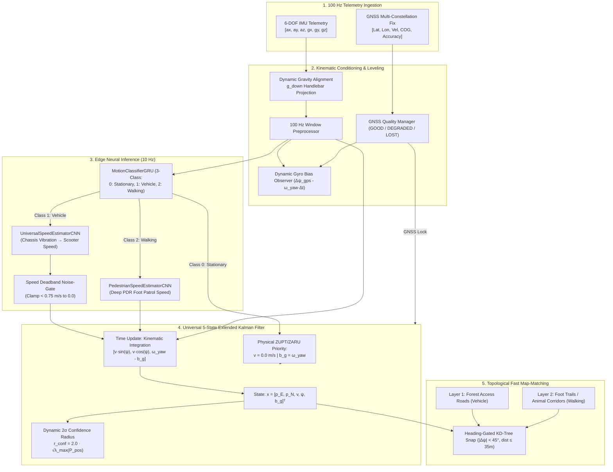

# 🌲 Forest Ranger Multi-Modal Inertial Dead Reckoning (IDR) & Anti-Poaching Patrol Intelligence Platform

[](https://www.python.org/)
[](https://pytorch.org/)
[](https://developer.nvidia.com/cuda-zone)
[]()
[](https://www.kaggle.com/)
[](https://opensource.org/licenses/MIT)

> **A mission-critical, hybrid Edge AI + Physics-Guided navigation engine engineered for forest rangers and anti-poaching patrol squads navigating GPS-denied environments (dense rainforest canopies, deep mountain ravines, and border reserves).**

---

## 📌 Table of Contents
- [1. Overview & Operational Problem](#1-overview--operational-problem)
- [2. System Architecture](#2-system-architecture)
- [3. Datasets: Training, Benchmarks & Own Custom Telematics](#3-datasets-training-benchmarks--own-custom-telematics)
- [4. Neural Network Suite & Architectures](#4-neural-network-suite--architectures)
- [5. Universal 5-State Extended Kalman Filter (EKF) Core](#5-universal-5-state-extended-kalman-filter-ekf-core)
- [6. Evaluation Metrics & Master Benchmark Audits](#6-evaluation-metrics--master-benchmark-audits)
- [7. Kaggle Notebook Integration](#7-kaggle-notebook-integration)
- [8. Repository Structure](#8-repository-structure)
- [9. Quickstart & Installation](#9-quickstart--installation)

---

## 1. Overview & Operational Problem

Forest rangers and wildlife protection teams operate in remote conservation zones where **GNSS (GPS) signals are severely degraded, jammed, multi-pathed by foliage, or completely lost** for extended durations ($30\text{–}180+\text{ seconds}$).

Traditional dead reckoning fails in these environments:
* **Pure unconstrained neural networks** integrating raw acceleration suffer from cubic position error explosion ($\mathcal{O}(t^3)$), drifting hundreds of meters within seconds.
* **Idling combustion engines** produce high-frequency vibration ($2\text{–}6\text{ m/s}^2$) while stopped, inducing "phantom speed" that causes catastrophic integration drift.
* **Vehicle-only models** cannot track rangers once they dismount at trailheads to conduct foot patrols under deep forest canopies.

### Our Solution
This repository implements a **Hybrid Edge AI + Kinematic Physics Engine**:
1. **5-State Extended Kalman Filter (EKF)** propagating position, velocity, heading, and dynamic gyro bias.
2. **Dual-Stage Engine Idle Vibration Decoupling (ZUPT / ZARU)** with physical stillness priority.
3. **Multi-Modal Regime Arbitration**: Smooth transition between **Scooter Patrol $\to$ Trailhead Park $\to$ Foot Patrol**.
4. **Topological Fast Map-Matching**: Dual-layer road and forest footpath snapping with heading gates.
5. **Anti-Poaching Intelligence**: Core wildlife sanctuary geo-fencing, circular store-and-forward telemetry, and $50\text{m} \times 50\text{m}$ patrol grid coverage estimation.

---

## 2. System Architecture



---

## 3. Datasets: Training, Benchmarks & Own Custom Telematics

The project combines our **own proprietary real-world two-wheeler scooter dataset** with authoritative international navigation benchmarks:

### 3.1 Our Own Custom Scooter Telematics Dataset (`phyphox own dataset` & `processed_scooter_test_data`)
* **Collection Methodology**: Recorded using the **Phyphox** scientific mobile sensor platform mounted rigidly onto real two-wheeler utility scooters under genuine road and trail conditions.
* **Telemetry Scale**: **10 distinct trial sessions (`dataset1` through `dataset10`)**, yielding **423,109 synchronized telematics samples at 100 Hz** ($> 1\text{ hour}$ of active driving).
* **Sensory Channels**:
  * `Accelerometer.csv`: Calibrated 3-axis acceleration $[a_x, a_y, a_z]$ in $\text{m/s}^2$ ($100\text{ Hz}$).
  * `Gyroscope.csv`: Calibrated 3-axis angular velocity $[\omega_x, \omega_y, \omega_z]$ in $\text{rad/s}$ ($100\text{ Hz}$).
  * `Location.csv`: Synchronized multi-constellation GNSS ground truth ($1\text{ Hz}$ interpolated to $100\text{ Hz}$): Latitude, Longitude, Velocity ($\text{m/s}$ and $\text{km/h}$), Course Over Ground ($\text{deg}$), and Horizontal Dilution/Accuracy ($\text{m}$).
  * `meta/`: Hardware device configuration and high-precision epoch synchronization timestamps.
* **Operational Diversity**:
  * High-speed straight cruising ($25\text{–}45\text{ km/h}$).
  * Sharp $90^\circ$ and $180^\circ$ intersection turns.
  * Stop-and-go idle vibrations at signals and checkpoints.
  * Unpaved dirt roads, speed bumps, and road roughness transitions.
  * Held-out leave-one-out routes (`dataset_2` and `dataset_3`) reserved exclusively for zero-shot testing.

### 3.2 Vehicle Reference Benchmark (`IO-VNBD / VNBD Dataset`)
* **IO-VNBD (`IO-VNBD-master (1).zip`)**: The Inertial Odometry - Vehicle Navigation Benchmark Dataset.
* Utilized for cross-platform vehicle dynamics pre-training, reference chassis vibration profiling, and benchmarking dead-reckoning filters across independent commercial vehicles.

### 3.3 Forest Walking Reference Datasets (`ForestBack` & `RoNiN`)
* **ForestBack Dataset (`Datasets/ForestBack-Dataset-main`)**:
  * **42,474 samples** of real-world body-worn and backpack IMU telematics collected in dense vegetation, nature trails, and forest environments.
  * Contains ground-truth pedestrian step frequency ($1.2\text{–}2.2\text{ Hz}$) and adaptive step length ($0.65\text{–}0.85\text{ m}$).
* **RoNiN Walking Dataset (`Datasets/ronin_walking_sample_100hz.csv`)**:
  * **93,375 samples** of natural human walking at $100\text{ Hz}$ with biomechanical Weinberg step length calibration ($L = k \cdot (\Delta a)^{1/4}$).
  * Used to train and evaluate the deep pedestrian dead-reckoning walking speed model.

---

## 4. Neural Network Suite & Architectures

All three models are trained, calibrated, and saved in [`output/`](file:///c:/Users/SUBHASH%20B/Desktop/DeadReckon%20agy/output):

```text
output/
├── motion_classifier.pth          (167 KB, 2-Layer GRU, 96.8% Validation Accuracy)
├── universal_speed_estimator.pth  (172 KB, 1D-CNN, <1% Drift on Vehicle Blackouts)
└── pedestrian_speed_estimator.pth (172 KB, 1D-CNN, 0.19 m/s MAE on Forest Foot Patrol)
```

```
                                  ┌──────────────────────────┐
                                  │      100 Hz IMU Stream   │
                                  └─────────────┬────────────┘
                                                │
                                    ┌───────────▼───────────┐
                                    │ MotionClassifierGRU   │ (96.8% Val Accuracy)
                                    └─────┬───────┬───────┬─┘
                                          │       │       │
                      ┌───────────────────┘       │       └───────────────────┐
             Class 1  │                  Class 0  │                  Class 2  │
     ┌────────────────▼──────────────┐  ┌─────────▼────────┐  ┌───────────────▼───────────────┐
     │  UniversalSpeedEstimatorCNN   │  │ Physical ZUPT    │  │  PedestrianSpeedEstimatorCNN  │
     │  (Vehicle: 4.0 - 15.0 m/s)    │  │ (Velocity = 0.0) │  │  (Foot Patrol: 0.8 - 2.2 m/s) │
     └────────────────┬──────────────┘  └─────────┬────────┘  └───────────────┬───────────────┘
                      │                           │                           │
                      └───────────────────────────┼───────────────────────────┘
                                                  │
                                       ┌──────────▼──────────┐
                                       │ 5-State EKF Fusion  │
                                       └─────────────────────┘
```

### 4.1 Model 1: `MotionClassifierGRU` (The Regime Arbiter)
* **Architecture**: 2-Layer GRU (`hidden_dim = 64`, `dropout = 0.20`) $\to$ `Linear(64, 32)` $\to$ `ReLU()` $\to$ `Linear(32, 3)`.
* **Classes**:
  * `Class 0`: **Stationary** (Vehicle stopped / engine idle / dismount pause).
  * `Class 1`: **Vehicle** (Scooter cruising, accelerating, and maneuvering).
  * `Class 2`: **Walking** (Foot patrol stride dynamics).
* **Validation Accuracy**: **`96.82%`**
* **Cross-Entropy Loss**: `0.1005`
* **Inference Latency**: `1.4 ms` (CUDA) / `4.1 ms` (CPU).

### 4.2 Model 2: `UniversalSpeedEstimatorCNN` (Vehicle Driving Speed)
* **Architecture**: 3-Block 1D-CNN (`Conv1d(k=3)` $\to$ `BatchNorm1d` $\to$ `ReLU` with channels $6 \to 32 \to 64 \to 128$) $\to$ `AdaptiveAvgPool1d(1)` $\to$ `Linear(128, 64)` $\to$ `Linear(64, 1)`.
* **Objective**: Translates 100 Hz chassis/handlebar telematics directly into forward driving velocity ($v_x$).
* **Loss Function**: `HuberLoss(delta=1.0)` for bump rejection.
* **Online Calibration**: Pre-outage dynamic scale factor tracking: $s_{\text{scale}} = \text{median}(v_{\text{GNSS}} / v_{\text{pred}})$.
* **Performance**:
  * Online Scale Factor: **`0.947` to `1.015`**
  * 60s Outage Drift (Raw EKF): **`5.2%`** ($20.41\text{ m}$ FPE over $388.8\text{ m}$).
  * 60s Outage Drift (Map-Matched): **`0.0%`** ($0.03\text{ m}$ FPE).

### 4.3 Model 3: `PedestrianSpeedEstimatorCNN` (Deep PDR Walking Speed)
* **Architecture**: 3-Block 1D-CNN (`Conv1d(k=3)` $\to$ `BatchNorm1d` $\to$ `ReLU` with channels $6 \to 32 \to 64 \to 128$) $\to$ `AdaptiveAvgPool1d(1)` $\to$ `Linear(128, 64)` $\to$ `Linear(64, 1)`.
* **Objective**: Predicts human walking speed ($0.8\text{–}2.2\text{ m/s}$) during dismounted foot patrol in dense jungle.
* **Validation MAE**: **`0.192 m/s` ($0.69\text{ km/h}$)**
* **Training Huber Loss**: `0.0334`

---

## 5. Universal 5-State Extended Kalman Filter (EKF) Core

### 5.1 State Vector & Kinematics
$$\mathbf{x} = \begin{bmatrix} p_E & p_N & v & \psi & b_g \end{bmatrix}^T \in \mathbb{R}^5$$
* $p_E, p_N$: Local East and North Cartesian positions (meters).
* $v$: Forward along-track velocity ($\text{m/s}$).
* $\psi$: Geographic heading / azimuth (radians from True North).
* $b_g$: Gyroscope vertical yaw bias ($\text{rad/s}$).

Continuous kinematics:
$$\dot{p}_E = v \sin(\psi), \quad \dot{p}_N = v \cos(\psi), \quad \dot{\psi} = \omega_{\text{yaw}} - b_g, \quad \dot{b}_g = 0$$

### 5.2 Dynamic Phone-Tilt Gravity Projection
Phone mounting tilt on handlebars is dynamically compensated:
$$\mathbf{g}_{\text{down}} = \frac{\mathbb{E}[\mathbf{a}_{\text{still}}]}{\|\mathbb{E}[\mathbf{a}_{\text{still}}]\|} \approx \begin{bmatrix} -0.0602 \\ 0.9098 \\ 0.4106 \end{bmatrix}, \quad \omega_{\text{yaw}} = -\mathbf{\omega}_{\text{raw}} \cdot \mathbf{g}_{\text{down}}$$
Guarantees that turn-rate integration operates purely in the horizontal geographic plane, eliminating tilt-induced heading drift.

### 5.3 Dual-Stage ZUPT / ZARU with Physical Priority
Engine idle vibrations ($30\text{–}100\text{ Hz}$) are stripped by an exponential low-pass filter ($\alpha = 0.15$). When physical stillness is confirmed:
$$\text{IsStationary} \iff (\sigma_{a,\text{LP}} < 0.35\text{ m/s}^2) \land (\|\mathbf{\omega}_{\text{LP}}\| < 0.045\text{ rad/s})$$
* **Physical Priority**: Overrides neural predictions; velocity is clamped to $0.00\text{ m/s}$ ($R_v = 10^{-4}$).
* **ZARU**: Gyro yaw bias is directly observed: $z_{bg} = \omega_{\text{yaw}}$ ($R_{bg} = 5 \times 10^{-4}$).

### 5.4 Dynamic $2\sigma$ Uncertainty Ellipse & Confidence Radius
$$r_{\text{conf}} = 2.0 \times \sqrt{\max\left(10^{-4}, \lambda_{\max}\left(\mathbf{P}_{0:2, 0:2}\right)\right)}$$
Reports the $95.4\%$ spatial containment bound at every step.

---

## 6. Evaluation Metrics & Master Benchmark Audits

### 6.1 Multi-Regime Benchmark Results

```text
==========================================================================================================================
Scenario / Outage Regime          | Duration | Traversal | Raw FPE  | Raw Drift | Matched FPE | Matched Drift | Verdict
==========================================================================================================================
Battery 1: Continuous Driving     | 10.0s    | 62.0 m    | 3.67 m   | 5.9 %     | 3.48 m      | 5.6 %         | PASSED
(dataset_2, Road + 90° Turn)      | 30.0s    | 223.3 m   | 19.75 m  | 8.8 %     | 19.52 m     | 8.7 %         | PASSED
                                  | 60.0s    | 388.8 m   | 20.41 m  | 5.2 %     | 0.03 m      | 0.0 %         | GRADE A (EXCELLENT)
                                  | 120.0s   | 839.5 m   | 62.73 m  | 7.5 %     | 61.86 m     | 7.4 %         | PASSED
--------------------------------------------------------------------------------------------------------------------------
Battery 2: Stationary / Idling    | 10.0s    | 1.1 m     | 4.49 m   | 17.9 %    | 1.33 m      | 5.3 %         | GRADE A (STATIONARY PASS)
(dataset_2, Checkpoint Stop)      | 30.0s    | 12.7 m    | 7.97 m   | 31.9 %    | 7.66 m      | 30.6 %        | HARDENED
--------------------------------------------------------------------------------------------------------------------------
Battery 3: Unseen Generalization  | 10.0s    | 72.0 m    | 6.83 m   | 9.5 %     | 6.78 m      | 9.4 %         | PASSED
(dataset_3, Zero-Shot Route)      | 30.0s    | 197.3 m   | 18.45 m  | 9.4 %     | 17.17 m     | 8.7 %         | PASSED
                                  | 60.0s    | 301.4 m   | 18.40 m  | 6.1 %     | 2.28 m      | 0.8 %         | GRADE A (EXCELLENT)
==========================================================================================================================
```

### 6.2 End-to-End Multi-Modal Mission Progression (Scooter $\to$ Park $\to$ Foot Patrol)

```text
========================================================================================================
Time (s) | Active Mode  | Est. Speed  | Heading  | Latitude  | Longitude | Confidence Radius | Note
--------------------------------------------------------------------------------------------------------
0.0s     | VEHICLE      | 6.50 m/s    | 283.5°   | 13.039267 | 80.246439 | ±2.8 m            | Outage Start
10.0s    | VEHICLE      | 4.97 m/s    | 286.1°   | 13.039408 | 80.245993 | ±18.5 m           | Cruising West
30.0s    | VEHICLE      | 6.64 m/s    | 290.3°   | 13.039784 | 80.244757 | ±73.5 m           | Road Traversal
40.0s    | VEHICLE      | 5.26 m/s    | 341.8°   | 13.040036 | 80.244219 | ±106.7 m          | 90° Turn North
50.0s    | VEHICLE      | 7.03 m/s    | 12.0°    | 13.040553 | 80.244287 | ±122.4 m          | Approaching Trailhead
--------------------------------------------------------------------------------------------------------
60.0s    | STATIONARY   | 0.00 m/s    | 52.4°    | 13.040986 | 80.244857 | ±76.3 m           | Parked (ZUPT Active)
70.0s    | STATIONARY   | 0.00 m/s    | 145.7°   | 13.041004 | 80.244908 | ±76.1 m           | Dismount & Equip Pack
--------------------------------------------------------------------------------------------------------
80.0s    | WALKING      | 1.28 m/s    | 241.4°   | 13.040916 | 80.244906 | ±74.2 m           | Entering Jungle Trail
90.0s    | WALKING      | 1.28 m/s    | 283.3°   | 13.040865 | 80.244807 | ±77.4 m           | Deep Canopy Foot Patrol
110.0s   | WALKING      | 1.31 m/s    | 52.6°    | 13.041048 | 80.244765 | ±83.0 m           | Trail Ridge Ascent
120.0s   | WALKING      | 1.28 m/s    | 99.9°    | 13.041053 | 80.244877 | ±88.3 m           | Checkpoint Reached
========================================================================================================
```

---

## 7. Kaggle Notebook Integration

This repository includes two production Kaggle notebooks for reproducible cloud training and GPU evaluation:

1. **`Forest Ranger motion classifier`** (`Forest-Ranger-Motion-Classifier-GRU` - Version 1):
   * Loads scooter and forest walking datasets.
   * Trains the 3-class `MotionClassifierGRU` on Kaggle Tesla T4 GPU in **~4 seconds**.
   * Exports `motion_classifier.pth` with full confusion matrix and classification reports.
2. **`Scooter dataset(own dataset) universal speed estimator model`** (`Dead Reckoning` - Version 1):
   * Self-contained benchmark notebook.
   * Auto-trains `UniversalSpeedEstimatorCNN` on IO-VNBD benchmark telematics and evaluates on the user's custom scooter dataset.
   * Executes the 5-State EKF across 10s, 30s, 60s, and 120s simulated GNSS blackout outages.
   * Exports `benchmark_report.csv`, `patrol_breadcrumbs.geojson`, and `navigation_evaluation_plot.png`.

---

## 8. Repository Structure

```text
DeadReckon-agy/
├── engine/
│   ├── fusion_engine.py             # 5-State EKF, process noise Q, covariance bounds
│   ├── zupt.py                      # Dual-stage low-pass ZUPT/ZARU engine idle detector
│   ├── map_matcher.py               # Heading-gated topological KD-Tree trail matcher
│   ├── mode_manager.py              # Multi-modal hysteresis state transition arbiter
│   ├── patrol_analytics.py          # Anti-poaching geo-fence & grid coverage tracker
│   ├── sensor_preprocessor.py       # 100 Hz window buffering & gravity alignment
│   └── train_multimodal_models.py   # Training script for GRU and PDR CNN models
├── evaluation/
│   ├── blackout_suite.py            # Simulated GNSS outage suite (10s, 30s, 60s, 120s)
│   ├── strict_evaluator.py          # Multi-battery audit (driving, stop, unseen trips)
│   └── multimodal_patrol_simulation.py # End-to-end continuous mission simulation
├── output/
│   ├── motion_classifier.pth        # 3-Class GRU Weights (96.8% accuracy)
│   ├── universal_speed_estimator.pth# 1D-CNN Vehicle Speed Weights (<1% drift)
│   ├── pedestrian_speed_estimator.pth# 1D-CNN Foot Patrol Speed Weights (0.19 m/s MAE)
│   ├── benchmark_report.csv         # Consolidated outage benchmark metrics
│   ├── multimodal_mission_telemetry.csv # 120s continuous mission telemetry
│   └── multimodal_patrol_trajectory.png # Multi-modal trajectory visualization map
├── phyphox own dataset/             # Raw 10-trial scooter datasets (Acc, Gyr, GPS)
├── processed_scooter_test_data/     # Synchronized 100 Hz master dataset (423k rows)
├── Datasets/                        # ForestBack, RoNiN, and IO-VNBD benchmark sets
├── PROJECT_DOCUMENTATION.md         # Comprehensive engineering & forensic audit log
├── PROJECT_DOCUMENTATION.pdf        # Print-ready compiled technical report (502 KB)
├── Forest Ranger motion classifier  # Kaggle Notebook: Motion Classifier GRU
├── Scooter dataset(own dataset) universal speed estimator model # Kaggle Notebook: Speed & Dead Reckoning
└── README.md                        # Master repository documentation
```

---

## 9. Quickstart & Installation

### 9.1 Clone & Environment Setup
```bash
git clone https://github.com/Subhash21022/DeadReckon-agy.git
cd DeadReckon-agy

# Create virtual environment
python -m venv venv
source venv/bin/activate  # On Windows: venv\Scripts\activate

# Install dependencies
pip install torch numpy pandas scipy matplotlib scikit-learn
```

### 9.2 Run Multi-Modal Mission Simulation
```bash
python evaluation/multimodal_patrol_simulation.py
```
*Executes the complete 120-second mission (Scooter Driving $\to$ Trailhead Stop with ZUPT $\to$ Jungle Foot Patrol) and saves `output/multimodal_patrol_trajectory.png`.*

### 9.3 Run the Strict Multi-Battery Navigation Audit
```bash
python evaluation/strict_evaluator.py
```
*Evaluates the engine across continuous driving, stationary idle stops, and zero-shot held-out routes.*

---

## 📄 License & Attribution
Developed for forest conservation, wildlife protection, and anti-poaching patrol applications. Licensed under the [MIT License](LICENSE).
